# 💼 My Project Contributions

A summary of my frontend contributions in two team projects built during my MCA program.

---

## 1. ShareMeal — Flutter App
🔗 [View Project](https://github.com/SHUBHAM-GITHUB1/ShareMeal)

**Role:** Frontend Developer (UI Lead)  
**Team Size:** 3 members  
**Tech Stack:** Flutter · Dart · Firebase Auth · OpenStreetMap

**About the Project:**  
ShareMeal is a real-time mobile app that connects surplus food donors with NGOs. Donors can broadcast food availability and NGOs can claim and track pickups — reducing food waste while feeding communities in need.

### 📸 Screenshots

| Login & Signup | Donor Dashboard | Map Picker |
|:-:|:-:|:-:|
| 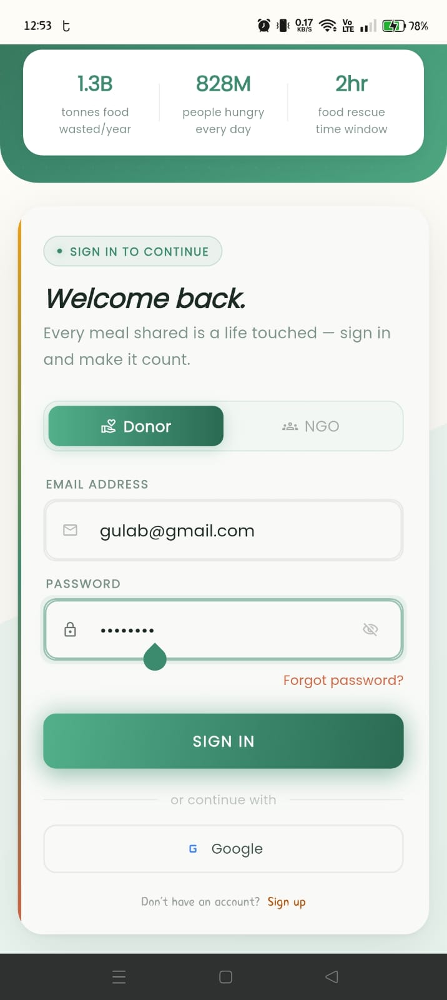 | 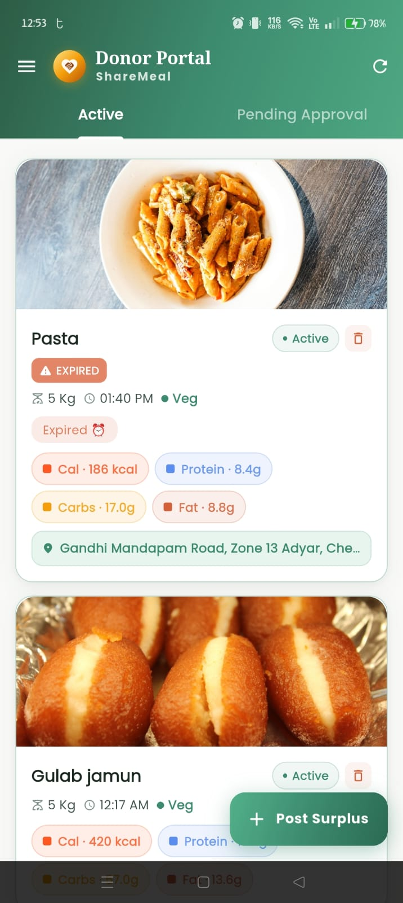 | 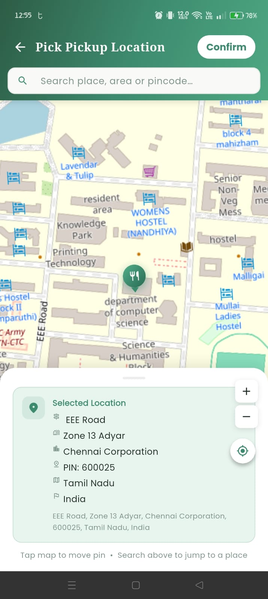 |

| NGO Live Feed | Claim Detail & Nutrition | Pickup Map |
|:-:|:-:|:-:|
|  | 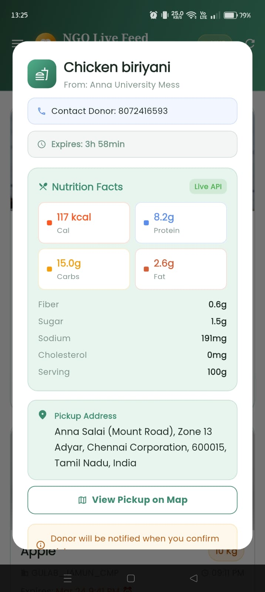 | 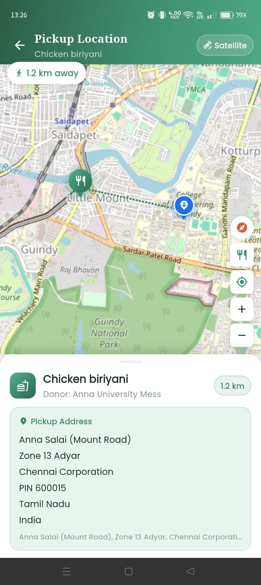 |

| Pending & Mark Pickup | Donation History | Confirm Claim |
|:-:|:-:|:-:|
| 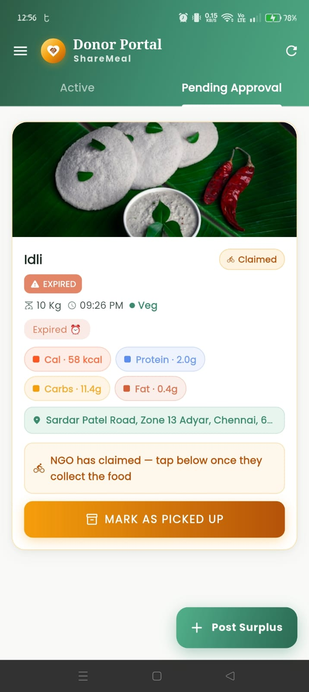 | 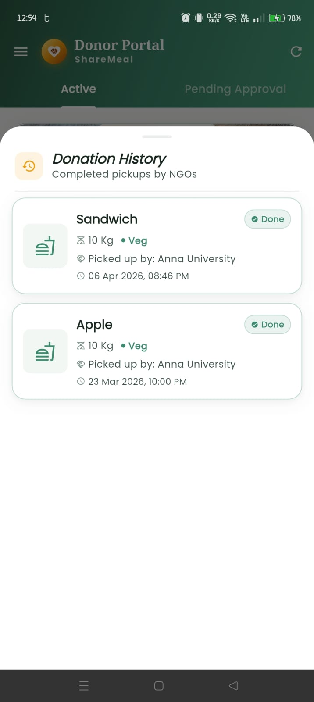 | 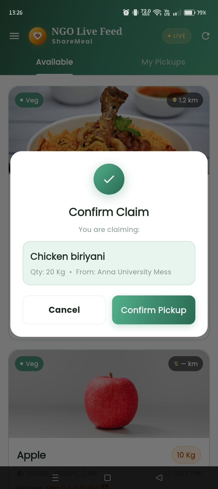 |

### What I built

- **Login & Signup Screen** — Animated hero section with slide/fade transitions, role-based toggle (Donor / NGO), form validation, Google Sign-In button, and forgot password flow
- **Splash Screen** — Entry animation with logo scale/fade and exit zoom transition
- **Donor Dashboard** — Tabbed layout (Active / Pending Approval), food post cards with nutrient chips, expiry badges, veg/non-veg indicators, and a claim status flow with dialogs
- **NGO Dashboard** — Live feed of available donations, claim confirmation dialogs, pickup history sheet, and distance labels using geolocation
- **Post Donation Bottom Sheet** — Full form with food name, quantity, veg toggle, image picker (camera/gallery), map-based location picker, and expiry time selector
- **Map Picker Screen** — Interactive OpenStreetMap with search, reverse geocoding, pin placement, and structured address card
- **Pickup Map Screen** — Navigation map showing donor location, NGO's current position, dotted polyline route, and distance badge
- **Shared Components** — AppBar with gradient, side drawer with dark mode toggle, donation/pickup history sheets, empty states, and snackbar notifications
- **App Theme & Design System** — Complete design token system: `AppColors`, `AppTextStyles`, `AppDimensions`, `AppDecorations`, `AppGradients`, light/dark `ThemeData`, and a responsive layout utility (`AppResponsive`) that scales across all screen sizes

---

## 2. Legal Ease — TypeScript Web App
🔗 [View Project](https://github.com/logesh-30/legal-ease)

**Role:** Frontend Developer (UI Enhancement & Feature Addition)  
**Team Size:** 3 members  
**Project Type:** Full Stack Web Application  
**Tech Stack (Full Project):** React · TypeScript · Vite · Tailwind CSS · Node.js · Express · MongoDB Atlas · JWT · i18next  

**About the Project:**  
Legal Ease is a bilingual (English / Tamil) full stack web application that helps Indian citizens discover government schemes, document services, and nearby government offices — all in one place.

### 📸 Screenshots

| Home Page (with Voice Search) | Document Services |
|:-:|:-:|
| 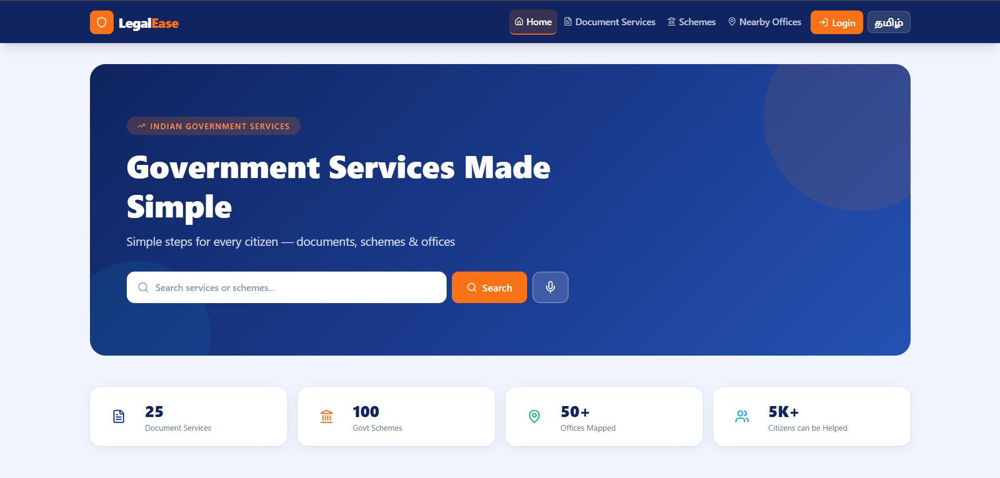 | 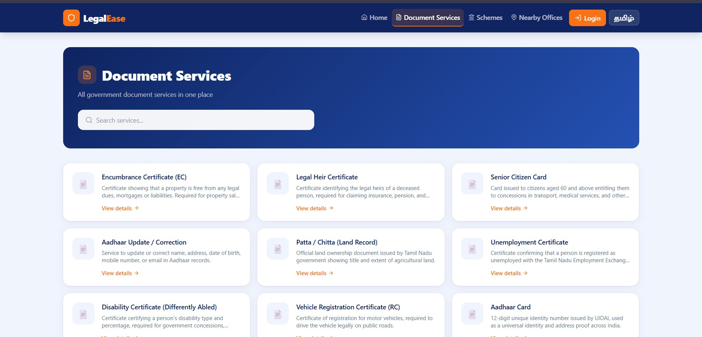 |

| Schemes Page (Tamil) | Scheme Detail (Tamil) |
|:-:|:-:|
| 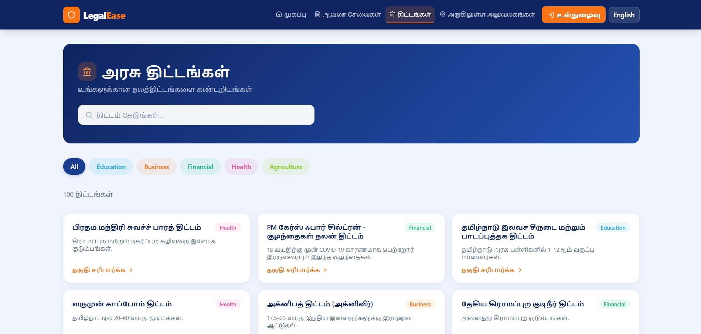 | 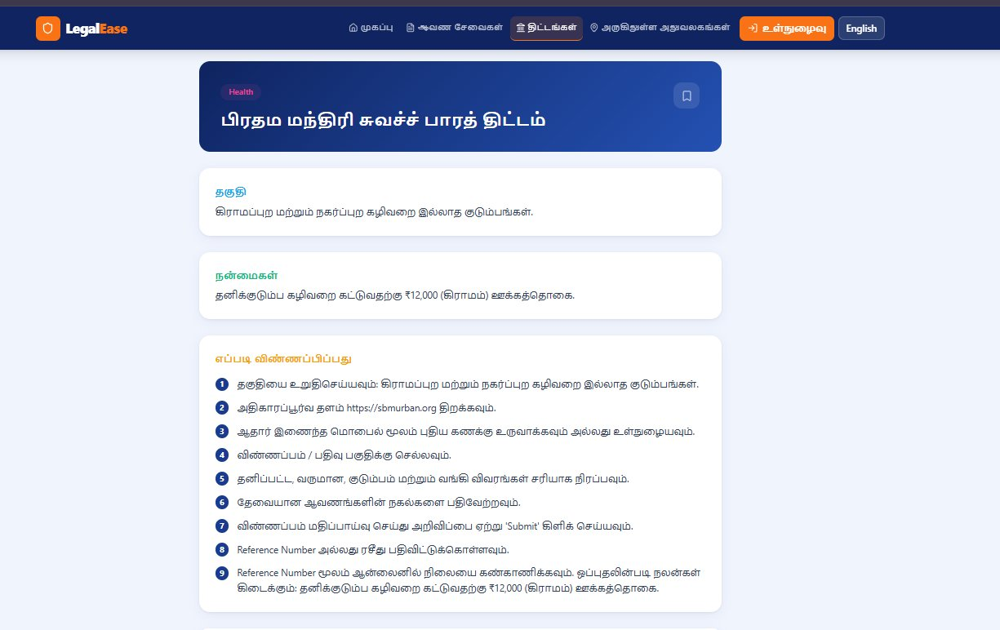 |

| Nearby Offices |
|:-:|
| 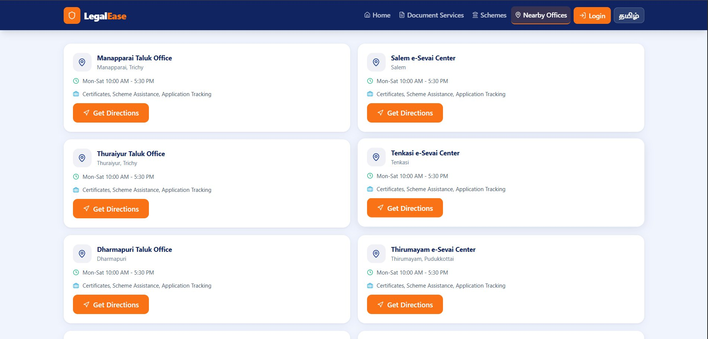 |

### What I built & improved

- **Home Page** — Redesigned the overall layout and visual hierarchy; built the live search dropdown that simultaneously matches both services and schemes as the user types; added a **Voice Search button** with pulsing ring animation, Tamil/English language switching, microphone permission error handling, and speech-to-route navigation
- **Schemes Page & Scheme Detail Page** — Category filter pills, search-from-URL (so voice search results land correctly), scheme cards with color-coded category badges, and an eligibility checker modal with dynamic question generation based on scheme rules
- **Services Page & Service Detail Page** — Searchable grid with URL-driven query state, step-by-step process cards, document checklist component, and bookmark save/unsave functionality
- **Eligibility Form Page** — Multi-section form (Personal, Location, Income, Occupation, Education, Social, Family, Special Conditions) with conditional fields (student sub-fields, farmer sub-fields), bilingual labels throughout, and inline validation
- **Eligible Schemes Page** — Matched scheme cards with "why you matched" reason tags, apply links, and redirect guard if eligibility form hasn't been filled
- **Offices Page** — Geolocation-based office finder with city dropdown fallback, skeleton loading states, and Google Maps directions link
- **Saved Page & Login Page** — Bookmarked services/schemes list, and a tabbed sign in/register form with icon inputs and validation
- **Bilingual UI fixes** — Audited all pages for layout breakage during English ↔ Tamil switching; fixed text overflow, misaligned grids, and truncated labels across every screen
- **General UI uplift** — Replaced the original basic UI with consistent gradient headers, card designs, color-coded category systems, skeleton loaders, and responsive grid layouts across the entire app

---

## 🛠 Skills Demonstrated

- React + TypeScript frontend development with React Query and React Hook Form
- Web Speech API integration (voice search with language switching)
- Bilingual UI architecture — building layouts that hold up in both English and Tamil without breaking
- Flutter UI development with custom painters, animations, and responsive layouts
- Dark mode theming and design system architecture in Flutter
- Map integration (OpenStreetMap / flutter\_map, Google Maps directions)
- Form validation, image handling, and real-time Firebase streams
- Component-level thinking: reusable widgets, shared state, clean separation of UI logic
